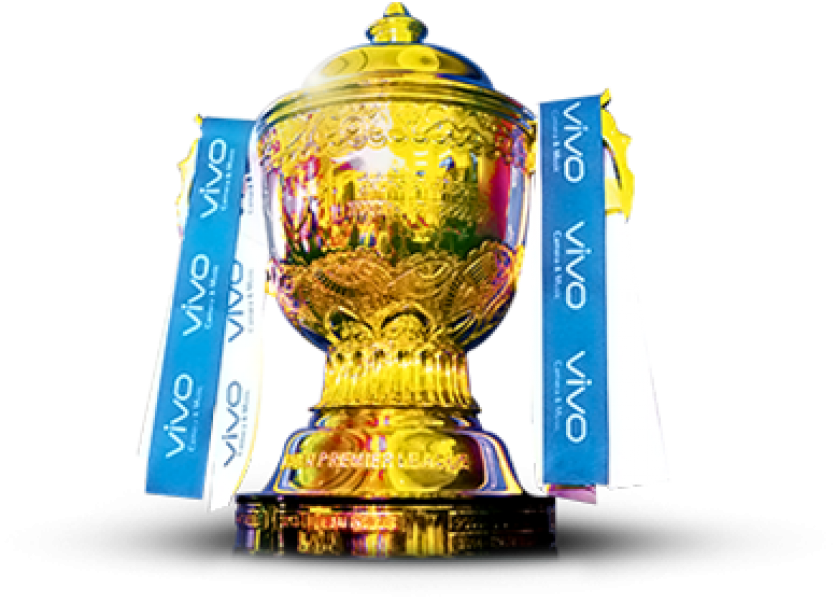

# Project Responsive Web Design using Bootstrap
## Date:07-05-2024

## AIM:
To design a responsive website for a Pharmaceutical Company using Bootstrap.


## DESIGN STEPS:

### Step 1:
Clone the repository from GitHub.

### Step 2:
Create Django Admin project.

### Step 3:
Create a New App under the Django Admin project.

### Step 4:
Insert the necessary CSS and JavaScript files as external in order to use Bootstrap.

### Step 5:
Create a HTML file and include the needed Bootstrap components.

### Step 6:
Publish the website in the LocalHost.

## PROGRAM :
Developed By:SETHUKKARASI C
Register Number:212223230201

homepage.html:
```
<!DOCTYPE html>
<html lang="en">

<head>
    <meta charset="UTF-8">
    <meta name="viewport" content="width=device-width, initial-scale=1.0">
    <title>Document</title>
    <link href="https://cdn.jsdelivr.net/npm/bootstrap@5.3.3/dist/css/bootstrap.min.css" rel="stylesheet"
        integrity="sha384-QWTKZyjpPEjISv5WaRU9OFeRpok6YctnYmDr5pNlyT2bRjXh0JMhjY6hW+ALEwIH" crossorigin="anonymous">
    <link rel="stylesheet" href="https://stackpath.bootstrapcdn.com/bootstrap/4.5.2/css/bootstrap.min.css">
</head>

<body background="giphy.gif" style="background-size: cover;">
    <nav class="navbar navbar-expand-lg bg-primary" data-bs-theme="dark">
        <div class="container-fluid">
            
            
            <button class="navbar-toggler" type="button" data-bs-toggle="collapse"
                data-bs-target="#navbarSupportedContent" aria-controls="navbarSupportedContent" aria-expanded="false"
                aria-label="Toggle navigation">
                <span class="navbar-toggler-icon"></span>
            </button>
            <div class="collapse navbar-collapse" id="navbarSupportedContent">
                <ul class="navbar-nav me-auto mb-2 mb-lg-0">
                    <li class="nav-item">
                        <a class="nav-link active" aria-current="page" href="Homepage.html">Home</a>
                    </li>
                    <li class="nav-item">
                        <a class="nav-link" href="century.html">Centuries</a>
                    </li>
                    <li class="nav-item dropdown">
                        <a class="nav-link dropdown-toggle" href="#" role="button" data-bs-toggle="dropdown"
                            aria-expanded="false">
                            Stats
                        </a>
                        <ul class="dropdown-menu">
                            <li><a class="dropdown-item" href="orange.html">Orange Cap</a></li>
                            <li><a class="dropdown-item" href="purple.html">Purple Cap</a></li>
                            <li>
                                <hr class="dropdown-divider">
                            </li>
                            <li><a class="dropdown-item" href="fours.html">Most Fours</a></li>
                        </ul>
                    </li>
                    <li class="nav-item">
                        <a class="nav-link" href="trophy.html">Former Champions</a>
                    </li>
                </ul>
            </div>
        </div>
    </nav>
    <h1 class="text-center font-weight-bold">
        10 TEAMS ONE TROPHY<br>
        NO SCORE IS SAFE HERE <br>
        THE CRICKET TOUNAMENT THAT YOU HAVE EVER SEEN
    </h1>
    <div class="container mt-5">
        <div class="row justify-content-center">
            <div class="col-md-3">
                
            </div>
            <div class="col-md-9">
                <div class="d-flex justify-content-between flex-wrap">
                    <!-- Add images around the center image -->
                    
                    
                    
                    
                    
                    
                    
                    
                    
                    
                </div>
            </div>
        </div>
    </div>

    <!-- jQuery and Bootstrap Bundle (includes Popper) -->
    <script src="https://code.jquery.com/jquery-3.5.1.slim.min.js"></script>
    <script src="https://cdn.jsdelivr.net/npm/@popperjs/core@2.5.4/dist/umd/popper.min.js"></script>
    <script src="https://stackpath.bootstrapcdn.com/bootstrap/4.5.2/js/bootstrap.min.js"></script>

    <script src="https://cdn.jsdelivr.net/npm/bootstrap@5.3.3/dist/js/bootstrap.bundle.min.js"
        integrity="sha384-YvpcrYf0tY3lHB60NNkmXc5s9fDVZLESaAA55NDzOxhy9GkcIdslK1eN7N6jIeHz"
        crossorigin="anonymous"></script>


</body>

</html>
```

century.html:
```
<!DOCTYPE html>
<html lang="en">

<head>
    <meta charset="UTF-8">
    <meta name="viewport" content="width=device-width, initial-scale=1.0">
    <title>Document</title>
    <link href="https://cdn.jsdelivr.net/npm/bootstrap@5.3.3/dist/css/bootstrap.min.css" rel="stylesheet"
        integrity="sha384-QWTKZyjpPEjISv5WaRU9OFeRpok6YctnYmDr5pNlyT2bRjXh0JMhjY6hW+ALEwIH" crossorigin="anonymous">
</head>

<body background="giphy4.gif" style="background-size: cover;">
    <nav class="navbar navbar-expand-lg bg-primary" data-bs-theme="dark">
        <div class="container-fluid">
            
            
            <button class="navbar-toggler" type="button" data-bs-toggle="collapse"
                data-bs-target="#navbarSupportedContent" aria-controls="navbarSupportedContent" aria-expanded="false"
                aria-label="Toggle navigation">
                <span class="navbar-toggler-icon"></span>
            </button>
            <div class="collapse navbar-collapse" id="navbarSupportedContent">
                <ul class="navbar-nav me-auto mb-2 mb-lg-0">
                    <li class="nav-item">
                        <a class="nav-link active" href="Homepage.html">Home</a>
                    </li>
                    <li class="nav-item">
                        <a class="nav-link" aria-current="page" href="century.html">Centuries</a>
                    </li>
                    <li class="nav-item dropdown">
                        <a class="nav-link dropdown-toggle" href="#" role="button" data-bs-toggle="dropdown"
                            aria-expanded="false">
                            Stats
                        </a>
                        <ul class="dropdown-menu">
                            <li><a class="dropdown-item" href="orange.html">Orange Cap</a></li>
                            <li><a class="dropdown-item" href="purple.html">Purple Cap</a></li>
                            <li>
                                <hr class="dropdown-divider">
                            </li>
                            <li><a class="dropdown-item" href="fours.html">Most Fours</a></li>
                        </ul>
                    </li>
                    <li class="nav-item">
                        <a class="nav-link" href="trophy.html">Former Champions</a>
                    </li>
                </ul>
            </div>
        </div>
    </nav>
    <div id="carouselExampleCaptions" class="carousel slide">
        <div class="carousel-indicators">
            <button type="button" data-bs-target="#carouselExampleCaptions" data-bs-slide-to="0" class="active"
                aria-current="true" aria-label="Slide 1"></button>
            <button type="button" data-bs-target="#carouselExampleCaptions" data-bs-slide-to="1"
                aria-label="Slide 2"></button>
            <button type="button" data-bs-target="#carouselExampleCaptions" data-bs-slide-to="2"
                aria-label="Slide 3"></button>
            <button type="button" data-bs-target="#carouselExampleCaptions" data-bs-slide-to="3"
                aria-label="Slide 4"></button>
            <button type="button" data-bs-target="#carouselExampleCaptions" data-bs-slide-to="4"
                aria-label="Slide 5"></button>
            <button type="button" data-bs-target="#carouselExampleCaptions" data-bs-slide-to="5"
                aria-label="Slide 6"></button>
            <button type="button" data-bs-target="#carouselExampleCaptions" data-bs-slide-to="6"
                aria-label="Slide 7"></button>
            <button type="button" data-bs-target="#carouselExampleCaptions" data-bs-slide-to="7"
                aria-label="Slide 8"></button>
            <button type="button" data-bs-target="#carouselExampleCaptions" data-bs-slide-to="8"
                aria-label="Slide 9"></button>
            <button type="button" data-bs-target="#carouselExampleCaptions" data-bs-slide-to="9"
                aria-label="Slide 10"></button>
            <button type="button" data-bs-target="#carouselExampleCaptions" data-bs-slide-to="10"
                aria-label="Slide 11"></button>
        </div>
        <div class="carousel-inner">
            <div class="carousel-item active">
                
                <div class="carousel-caption d-none d-md-block">
                    <h5>VIRAT KOHLI</h5>
                    <p>113 against RR in Jaipur.</p>
                </div>
            </div>
            <div class="carousel-item">
                
                <div class="carousel-caption d-none d-md-block">
                    <h5>RUTURAJ GAIKWAD</h5>
                    <p>108 against LSG in Chepauk.</p>
                </div>
            </div>
            <div class="carousel-item">
                
                <div class="carousel-caption d-none d-md-block">
                    <h5>ROHIT SHARMA</h5>
                    <p>105 against CSK in Mumbai.</p>
                </div>
            </div>
            <div class="carousel-item">
                
                <div class="carousel-caption d-none d-md-block">
                    <h5>SURYA KUMAR YADAV</h5>
                    <p>102 against SRH in Mumbai.</p>
                </div>
            </div>
            <div class="carousel-item">
                
                <div class="carousel-caption d-none d-md-block">
                    <h5>YASHASVI JAISWAL</h5>
                    <p>104 against MI in Jaipur.</p>
                </div>
            </div>
            <div class="carousel-item">
                
                <div class="carousel-caption d-none d-md-block">
                    <h5>JOS BUTTLER</h5>
                    <p>107 against KKR in Kolkatta.<br>100 against RCB in Jaipur.</p>
                </div>
            </div>
            <div class="carousel-item">
                
                <div class="carousel-caption d-none d-md-block">
                    <h5>WILL JACKS</h5>
                    <p>100 against GT in Ahmedabad.</p>
                </div>
            </div>
            <div class="carousel-item">
                
                <div class="carousel-caption d-none d-md-block">
                    <h5>JOHNNY BAIRSTOW</h5>
                    <p>108 against KKR in Kolkatta.</p>
                </div>
            </div>
            <div class="carousel-item">
                
                <div class="carousel-caption d-none d-md-block">
                    <h5>TRAVIS HEAD</h5>
                    <p>102 against RCB in Bangaluru.</p>
                </div>
            </div>
            <div class="carousel-item">
                
                <div class="carousel-caption d-none d-md-block">
                    <h5>SUNIL NARINE</h5>
                    <p>109 against RR in Kolkatta.</p>
                </div>
            </div>
            <div class="carousel-item">
                
                <div class="carousel-caption d-none d-md-block">
                    <h5>MARCUS STOINIS</h5>
                    <p>124 against CSK in Chepauk.</p>
                </div>
            </div>
        </div>
        <button class="carousel-control-prev" type="button" data-bs-target="#carouselExampleCaptions"
            data-bs-slide="prev">
            <span class="carousel-control-prev-icon" aria-hidden="true"></span>
            <span class="visually-hidden">Previous</span>
        </button>
        <button class="carousel-control-next" type="button" data-bs-target="#carouselExampleCaptions"
            data-bs-slide="next">
            <span class="carousel-control-next-icon" aria-hidden="true"></span>
            <span class="visually-hidden">Next</span>
        </button>
    </div>
    <script src="https://cdn.jsdelivr.net/npm/bootstrap@5.3.3/dist/js/bootstrap.bundle.min.js"
        integrity="sha384-YvpcrYf0tY3lHB60NNkmXc5s9fDVZLESaAA55NDzOxhy9GkcIdslK1eN7N6jIeHz"
        crossorigin="anonymous"></script>
</body>

</html>
```

orange.html:
```
<!DOCTYPE html>
<html lang="en">

<head>
    <meta charset="UTF-8">
    <meta name="viewport" content="width=device-width, initial-scale=1.0">
    <title>Document</title>
    <link href="https://cdn.jsdelivr.net/npm/bootstrap@5.3.3/dist/css/bootstrap.min.css" rel="stylesheet"
        integrity="sha384-QWTKZyjpPEjISv5WaRU9OFeRpok6YctnYmDr5pNlyT2bRjXh0JMhjY6hW+ALEwIH" crossorigin="anonymous">
</head>

<body background="giphy6.gif" style="background-size: cover;">
    <nav class="navbar navbar-expand-lg bg-primary" data-bs-theme="dark">
        <div class="container-fluid">
            
            
            <button class="navbar-toggler" type="button" data-bs-toggle="collapse"
                data-bs-target="#navbarSupportedContent" aria-controls="navbarSupportedContent" aria-expanded="false"
                aria-label="Toggle navigation">
                <span class="navbar-toggler-icon"></span>
            </button>
            <div class="collapse navbar-collapse" id="navbarSupportedContent">
                <ul class="navbar-nav me-auto mb-2 mb-lg-0">
                    <li class="nav-item">
                        <a class="nav-link active" href="Homepage.html">Home</a>
                    </li>
                    <li class="nav-item">
                        <a class="nav-link" href="century.html">Centuries</a>
                    </li>
                    <li class="nav-item dropdown">
                        <a class="nav-link dropdown-toggle" href="#" role="button" data-bs-toggle="dropdown"
                            aria-expanded="false">
                            Stats
                        </a>
                        <ul class="dropdown-menu">
                            <li><a class="dropdown-item" aria-current="page" href="orange.html">Orange Cap</a></li>
                            <li><a class="dropdown-item" href="purple.html">Purple Cap</a></li>
                            <li>
                                <hr class="dropdown-divider">
                            </li>
                            <li><a class="dropdown-item" href="fours.html">Most Fours</a></li>
                        </ul>
                    </li>
                    <li class="nav-item">
                        <a class="nav-link" href="trophy.html">Former Champions</a>
                    </li>
                </ul>
            </div>
        </div>
    </nav>
    <div class="d-flex">
        <div class="card" style="width: 18rem;">
            
            <div class="card-body bg-success text-white text-center">
                <h5 class="card-title">VIRAT KOHLI</h5>
                <p class="card-text">Royal Challengers Bangaluru<br>542 runs</p>
            </div>
        </div>
        <div class="card" style="width: 18rem;">
            
            <div class="card-body bg-danger text-white text-center">
                <h5 class="card-title">RUTURAJ GAIKWAD</h5>
                <p class="card-text">Chennai Super Kings<br>541 runs</p>
            </div>
        </div>
        <div class="card" style="width: 18rem;">
            
            <div class="card-body bg-success text-white text-center">
                <h5 class="card-title">SANJU SAMSON</h5>
                <p class="card-text">Rajasthan Royals<br>464 runs</p>
            </div>
        </div>
        <div class="card" style="width: 18rem;">
            
            <div class="card-body bg-danger text-white text-center">
                <h5 class="card-title">SUNIL NARINE</h5>
                <p class="card-text">Kolkata Knight Riders<br>461 runs</p>
            </div>
        </div>
        <div class="card" style="width: 18rem;">
            
            <div class="card-body bg-success text-white text-center">
                <h5 class="card-title">TRAVIS HEAD</h5>
                <p class="card-text">Sunrisers Hyderabad><br>444 runs</p>
            </div>
        </div>
    </div>
    <script src="https://cdn.jsdelivr.net/npm/bootstrap@5.3.3/dist/js/bootstrap.bundle.min.js"
        integrity="sha384-YvpcrYf0tY3lHB60NNkmXc5s9fDVZLESaAA55NDzOxhy9GkcIdslK1eN7N6jIeHz"
        crossorigin="anonymous"></script>
</body>

</html>
```

purple.html:
```
<!DOCTYPE html>
<html lang="en">

<head>
    <meta charset="UTF-8">
    <meta name="viewport" content="width=device-width, initial-scale=1.0">
    <title>Document</title>
    <link href="https://cdn.jsdelivr.net/npm/bootstrap@5.3.3/dist/css/bootstrap.min.css" rel="stylesheet"
        integrity="sha384-QWTKZyjpPEjISv5WaRU9OFeRpok6YctnYmDr5pNlyT2bRjXh0JMhjY6hW+ALEwIH" crossorigin="anonymous">
</head>

<body background="giphy5.gif" style="background-size: cover;">
    <nav class="navbar navbar-expand-lg bg-primary" data-bs-theme="dark">
        <div class="container-fluid">
            
            
            <button class="navbar-toggler" type="button" data-bs-toggle="collapse"
                data-bs-target="#navbarSupportedContent" aria-controls="navbarSupportedContent" aria-expanded="false"
                aria-label="Toggle navigation">
                <span class="navbar-toggler-icon"></span>
            </button>
            <div class="collapse navbar-collapse" id="navbarSupportedContent">
                <ul class="navbar-nav me-auto mb-2 mb-lg-0">
                    <li class="nav-item">
                        <a class="nav-link active" href="Homepage.html">Home</a>
                    </li>
                    <li class="nav-item">
                        <a class="nav-link" href="century.html">Centuries</a>
                    </li>
                    <li class="nav-item dropdown">
                        <a class="nav-link dropdown-toggle" href="#" role="button" data-bs-toggle="dropdown"
                            aria-expanded="false">
                            Stats
                        </a>
                        <ul class="dropdown-menu">
                            <li><a class="dropdown-item" href="orange.html">Orange Cap</a></li>
                            <li><a class="dropdown-item" aria-current="page" href="purple.html">Purple Cap</a></li>
                            <li>
                                <hr class="dropdown-divider">
                            </li>
                            <li><a class="dropdown-item" href="fours.html">Most Fours</a></li>
                        </ul>
                    </li>
                    <li class="nav-item">
                        <a class="nav-link" href="trophy.html">Former Champions</a>
                    </li>
                </ul>
            </div>
        </div>
    </nav>
    <div class="d-flex">
        <div class="card" style="width: 18rem;">
            
            <div class="card-body bg-danger text-white text-center">
                <h5 class="card-title">JASPRIT BUMRAH</h5>
                <p class="card-text">Mumbai Indians<br>18 wickets</p>
            </div>
        </div>
        <div class="card" style="width: 18rem;">
            
            <div class="card-body bg-success text-white text-center">
                <h5 class="card-title">HARSHAL PATEL</h5>
                <p class="card-text">Punjab Kings<br>17 wickets</p>
            </div>
        </div>
        <div class="card" style="width: 18rem;">
            
            <div class="card-body bg-danger text-white text-center">
                <h5 class="card-title">VARUN CHAKARAVARTHY</h5>
                <p class="card-text">Kolkata Knight Riders<br>16 wickets</p>
            </div>
        </div>
        <div class="card" style="width: 18rem;">
            
            <div class="card-body bg-success text-white text-center">
                <h5 class="card-title">T NATARAJAN</h5>
                <p class="card-text">Sunrisers Hyderabad<br>15 wickets</p>
            </div>
        </div>
        <div class="card" style="width: 18rem;">
            
            <div class="card-body bg-danger text-white text-center">
                <h5 class="card-title">ARSHDEEP SINGH</h5>
                <p class="card-text">Punjab Kings<br>15 wickets</p>
            </div>
        </div>
    </div>
    <script src="https://cdn.jsdelivr.net/npm/bootstrap@5.3.3/dist/js/bootstrap.bundle.min.js"
        integrity="sha384-YvpcrYf0tY3lHB60NNkmXc5s9fDVZLESaAA55NDzOxhy9GkcIdslK1eN7N6jIeHz"
        crossorigin="anonymous"></script>
</body>

</html>
```

fours.html:
```
<!DOCTYPE html>
<html lang="en">

<head>
    <meta charset="UTF-8">
    <meta name="viewport" content="width=device-width, initial-scale=1.0">
    <title>Document</title>
    <link href="https://cdn.jsdelivr.net/npm/bootstrap@5.3.3/dist/css/bootstrap.min.css" rel="stylesheet"
        integrity="sha384-QWTKZyjpPEjISv5WaRU9OFeRpok6YctnYmDr5pNlyT2bRjXh0JMhjY6hW+ALEwIH" crossorigin="anonymous">
</head>

<body background="giphy2.gif" style="background-size: cover;">
    <nav class="navbar navbar-expand-lg bg-primary" data-bs-theme="dark">
        <div class="container-fluid">
            
            
            <button class="navbar-toggler" type="button" data-bs-toggle="collapse"
                data-bs-target="#navbarSupportedContent" aria-controls="navbarSupportedContent" aria-expanded="false"
                aria-label="Toggle navigation">
                <span class="navbar-toggler-icon"></span>
            </button>
            <div class="collapse navbar-collapse" id="navbarSupportedContent">
                <ul class="navbar-nav me-auto mb-2 mb-lg-0">
                    <li class="nav-item">
                        <a class="nav-link active" href="Homepage.html">Home</a>
                    </li>
                    <li class="nav-item">
                        <a class="nav-link" href="century.html">Centuries</a>
                    </li>
                    <li class="nav-item dropdown">
                        <a class="nav-link dropdown-toggle" href="#" role="button" data-bs-toggle="dropdown"
                            aria-expanded="false">
                            Stats
                        </a>
                        <ul class="dropdown-menu">
                            <li><a class="dropdown-item" href="orange.html">Orange Cap</a></li>
                            <li><a class="dropdown-item" href="purple.html">Purple Cap</a></li>
                            <li>
                                <hr class="dropdown-divider">
                            </li>
                            <li><a class="dropdown-item" aria-current="page" href="fours.html">Most Fours</a></li>
                        </ul>
                    </li>
                    <li class="nav-item">
                        <a class="nav-link" href="trophy.html">Former Champions</a>
                    </li>
                </ul>
            </div>
        </div>
    </nav>
    <div class="d-flex">
        <div class="card" style="width: 18rem;">
            
            <div class="card-body bg-success text-white text-center">
                <h5 class="card-title">RUTURAJ GAIKWAD</h5>
                <p class="card-text">Chennai Super Kings<br>57 fours</p>
            </div>
        </div>
        <div class="card" style="width: 18rem;">
            
            <div class="card-body bg-danger text-white text-center">
                <h5 class="card-title">TRAVIS HEAD</h5>
                <p class="card-text">Sunrisers Hyderabad<br>53 fours</p>
            </div>
        </div>
        <div class="card" style="width: 18rem;">
            
            <div class="card-body bg-success text-white text-center">
                <h5 class="card-title">PHIL SALT</h5>
                <p class="card-text">Kolkata Knight Riders<br>50 fours</p>
            </div>
        </div>
        <div class="card" style="width: 18rem;">
            
            <div class="card-body bg-danger text-white text-center">
                <h5 class="card-title">VIRAT KOHLI</h5>
                <p class="card-text">Royal Challengers Bangaluru<br>48 fours</p>
            </div>
        </div>
        <div class="card" style="width: 18rem;">
            
            <div class="card-body bg-success text-white text-center">
                <h5 class="card-title">SUNIL NARINE</h5>
                <p class="card-text">Kolkata Knight Riders<br>46 fours</p>
            </div>
        </div>
    </div>
    <script src="https://cdn.jsdelivr.net/npm/bootstrap@5.3.3/dist/js/bootstrap.bundle.min.js"
        integrity="sha384-YvpcrYf0tY3lHB60NNkmXc5s9fDVZLESaAA55NDzOxhy9GkcIdslK1eN7N6jIeHz"
        crossorigin="anonymous"></script>
</body>

</html>
```

trophy.html:
```
<!DOCTYPE html>
<html lang="en">

<head>
    <meta charset="UTF-8">
    <meta name="viewport" content="width=device-width, initial-scale=1.0">
    <title>Document</title>
    <link rel="stylesheet" href="https://stackpath.bootstrapcdn.com/bootstrap/4.5.2/css/bootstrap.min.css">
    <link href="https://cdn.jsdelivr.net/npm/bootstrap@5.3.3/dist/css/bootstrap.min.css" rel="stylesheet"
        integrity="sha384-QWTKZyjpPEjISv5WaRU9OFeRpok6YctnYmDr5pNlyT2bRjXh0JMhjY6hW+ALEwIH" crossorigin="anonymous">
</head>

<body background="giphy3.gif" style="background-size: cover;">
    <nav class="navbar navbar-expand-lg bg-primary" data-bs-theme="dark">
        <div class="container-fluid">
            
            
            <button class="navbar-toggler" type="button" data-bs-toggle="collapse"
                data-bs-target="#navbarSupportedContent" aria-controls="navbarSupportedContent" aria-expanded="false"
                aria-label="Toggle navigation">
                <span class="navbar-toggler-icon"></span>
            </button>
            <div class="collapse navbar-collapse" id="navbarSupportedContent">
                <ul class="navbar-nav me-auto mb-2 mb-lg-0">
                    <li class="nav-item">
                        <a class="nav-link active" href="Homepage.html">Home</a>
                    </li>
                    <li class="nav-item">
                        <a class="nav-link" href="century.html">Centuries</a>
                    </li>
                    <li class="nav-item dropdown">
                        <a class="nav-link dropdown-toggle" href="#" role="button" data-bs-toggle="dropdown"
                            aria-expanded="false">
                            Stats
                        </a>
                        <ul class="dropdown-menu">
                            <li><a class="dropdown-item" href="orange.html">Orange Cap</a></li>
                            <li><a class="dropdown-item" href="purple.html">Purple Cap</a></li>
                            <li>
                                <hr class="dropdown-divider">
                            </li>
                            <li><a class="dropdown-item" href="fours.html">Most Fours</a></li>
                        </ul>
                    </li>
                    <li class="nav-item">
                        <a class="nav-link" aria-current="page" href="trophy.html">Former Champions</a>
                    </li>
                </ul>
            </div>
        </div>
    </nav>
    <div class="container">
        <div class="row justify-content-center">
            <div class="row mb-4">
                <div class="col-lg-4">
                    <div class="card">
                        
                        <div class="card-body bg-danger text-white text-center">
                            <h5 class="card-title">YEAR:2008</h5>
                            <p class="card-text">Champions:Rajasthan Royals</p>
                        </div>
                    </div>
                </div>
                <div class="col-lg-4">
                    <div class="card">
                        
                        <div class="card-body bg-success text-white text-center">
                            <h5 class="card-title">YEAR:2009</h5>
                            <p class="card-text">Champions:Deccan Chargers</p>
                        </div>
                    </div>
                </div>
                <div class="col-lg-4">
                    <div class="card">
                        
                        <div class="card-body bg-danger text-white text-center">
                            <h5 class="card-title">YEAR:2010</h5>
                            <p class="card-text">Champions:Chennai Super Kings</p>
                        </div>
                    </div>
                </div>
                <div class="col-lg-4">
                    <div class="card">
                        
                        <div class="card-body bg-success text-white text-center">
                            <h5 class="card-title">YEAR:2011</h5>
                            <p class="card-text">Champions:Chennai Super Kings</p>
                        </div>
                    </div>
                </div>
                <div class="col-lg-4">
                    <div class="card">
                        
                        <div class="card-body bg-danger text-white text-center">
                            <h5 class="card-title">YEAR:2012</h5>
                            <p class="card-text">Champions:Kolkata Knight Riders</p>
                        </div>
                    </div>
                </div>
                <div class="col-lg-4">
                    <div class="card">
                        
                        <div class="card-body bg-success text-white text-center">
                            <h5 class="card-title">YEAR:2013</h5>
                            <p class="card-text">Champions:Mumbai Indians</p>
                        </div>
                    </div>
                </div>
                <div class="col-lg-4">
                    <div class="card">
                        
                        <div class="card-body bg-danger text-white text-center">
                            <h5 class="card-title">YEAR:2014</h5>
                            <p class="card-text">Champions:Kolkata Knight Riders</p>
                        </div>
                    </div>
                </div>
                <div class="col-lg-4">
                    <div class="card">
                        
                        <div class="card-body bg-success text-white text-center">
                            <h5 class="card-title">YEAR:2015</h5>
                            <p class="card-text">Champions:Mumbai Indians</p>
                        </div>
                    </div>
                </div>
                <div class="col-lg-4">
                    <div class="card">
                        
                        <div class="card-body bg-danger text-white text-center">
                            <h5 class="card-title">YEAR:2016</h5>
                            <p class="card-text">Champions:Sunrisers Hyderabad</p>
                        </div>
                    </div>
                </div>
                <div class="col-lg-4">
                    <div class="card">
                        
                        <div class="card-body bg-success text-white text-center">
                            <h5 class="card-title">YEAR:2017</h5>
                            <p class="card-text">Champions:Mumbai Indians</p>
                        </div>
                    </div>
                </div>
                <div class="col-lg-4">
                    <div class="card">
                        
                        <div class="card-body bg-danger text-white text-center">
                            <h5 class="card-title">YEAR:2018</h5>
                            <p class="card-text">Champions:Chennai Super Kings</p>
                        </div>
                    </div>
                </div>
                <div class="col-lg-4">
                    <div class="card">
                        
                        <div class="card-body bg-success text-white text-center">
                            <h5 class="card-title">YEAR:2019</h5>
                            <p class="card-text">Champions:Mumbai Indians</p>
                        </div>
                    </div>
                </div>
                <div class="col-lg-4">
                    <div class="card">
                        
                        <div class="card-body bg-danger text-white text-center">
                            <h5 class="card-body">YEAR:2020</h5>
                            <p class="card-text">Champions:Mumbai Indians</p>
                        </div>
                    </div>
                </div>
                <div class="col-lg-4">
                    <div class="card">
                        
                        <div class="card-body bg-success text-white text-center">
                            <h5 class="card-title">YEAR:2021</h5>
                            <p class="card-text">Champions:Chennai Super Kings</p>
                        </div>
                    </div>
                </div>
                <div class="col-lg-4">
                    <div class="card">
                        
                        <div class="card-body bg-danger text-white text-center">
                            <h5 class="card-title">YEAR:2022</h5>
                            <p class="card-text">Champions:Gujarat Titans</p>
                        </div>
                    </div>
                </div>
                <div class="col-lg-4">
                    <div class="card">
                        
                        <div class="card-body bg-success text-white text-center">
                            <h5 class="card-title">YEAR:2023</h5>
                            <p class="card-text">Champions:Chennai Super Kings</p>
                        </div>
                    </div>
                </div>
            </div>
        </div>

        <script src="https://code.jquery.com/jquery-3.5.1.slim.min.js"></script>
        <script src="https://cdn.jsdelivr.net/npm/@popperjs/core@2.5.4/dist/umd/popper.min.js"></script>
        <script src="https://stackpath.bootstrapcdn.com/bootstrap/4.5.2/js/bootstrap.min.js"></script>

        <script src="https://cdn.jsdelivr.net/npm/bootstrap@5.3.3/dist/js/bootstrap.bundle.min.js"
            integrity="sha384-YvpcrYf0tY3lHB60NNkmXc5s9fDVZLESaAA55NDzOxhy9GkcIdslK1eN7N6jIeHz"
            crossorigin="anonymous"></script>
</body>

</html>
```

## OUTPUT:

 
 
 
 
 

## RESULT:
The Project for responsive web design using Bootstrap is completed successfully.
